# {ggexplorer} 

[](https://www.tidyverse.org/lifecycle/#experimental)

The idea of ​​{ggexplorer} is to create plots with minimal effort using {ggplot2} for the purpose of exploring and analyzing data.

## Installation

Install the development version from GitHub:

```r
remotes::install_github("zpio/tidyexplorer")
```

## Getting Started

**Explore**

- [`plotHistogram()`](#plothistogram)

  [(examples)](https://francisco.quarto.pub/explore-numeric-columns-with-histogram/)

  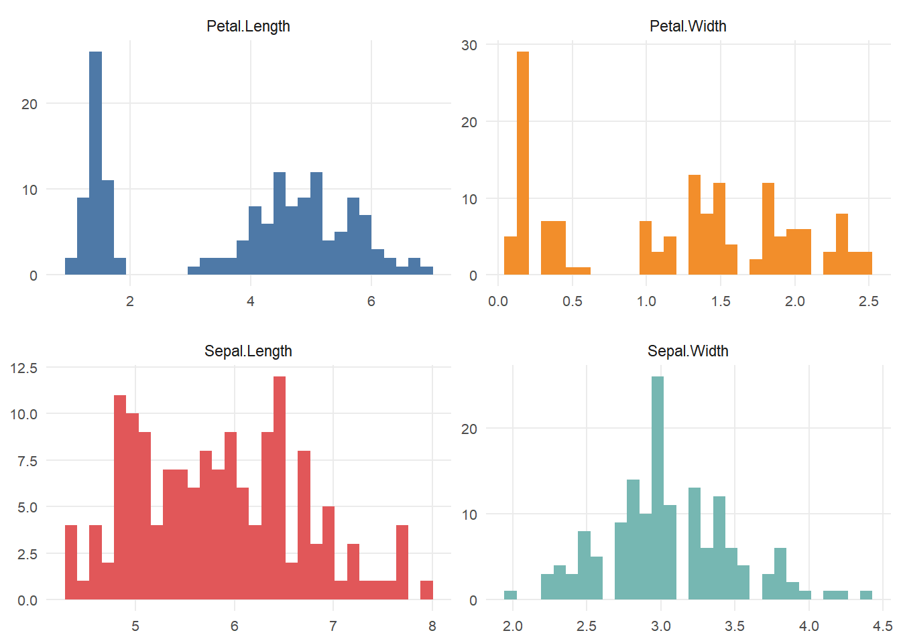

- [`plotDensity()`](#plotdensity)

  [(examples)](https://francisco.quarto.pub/explore-numeric-columns-with-density-plot/)

  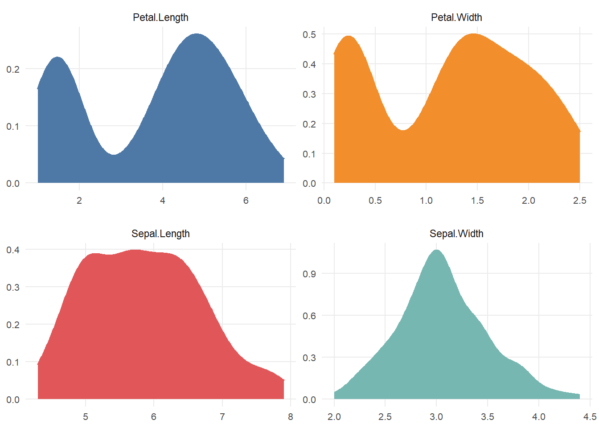

- [`plotScatter()`](#plotscatter)

  [(examples)](https://francisco.quarto.pub/explore-numeric-columns-with-scatterplot/)

  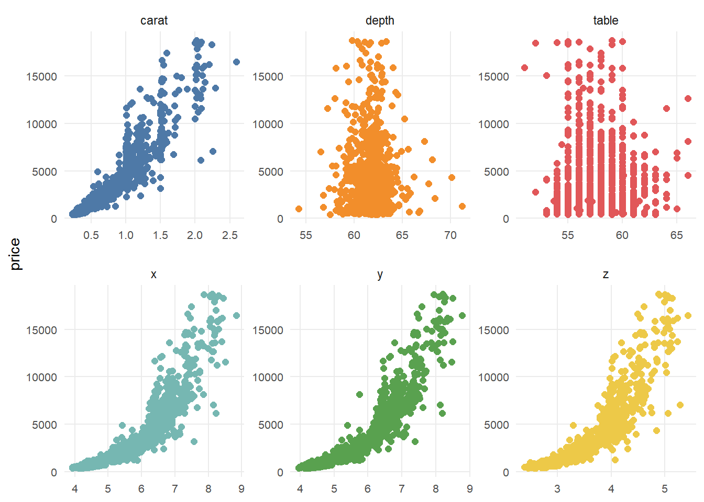
  
- [`plotBar()`](#plotbar)

  [(examples)](https://francisco.quarto.pub/explore-categorical-columns-with-bar-charts/)

  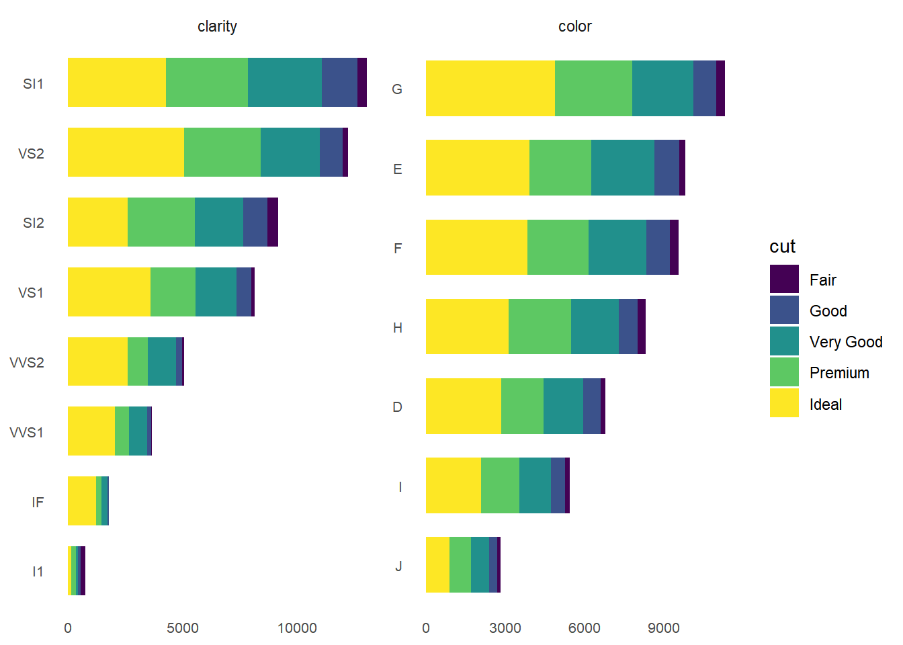

- [`plotBoxplot()`](#plotboxplot)

  [(examples)](https://francisco.quarto.pub/explore-numeric-and-categorical-columns-with-boxplot/)

  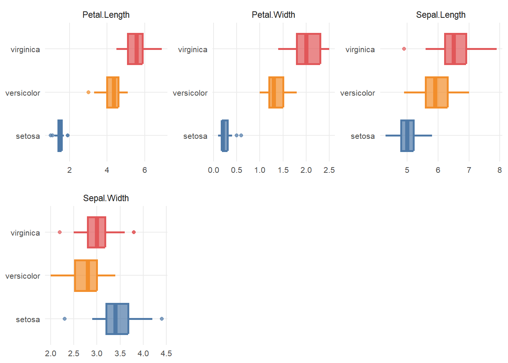

- [`plotViolin()`](#plotviolin)

  [(examples)](https://francisco.quarto.pub/explore-numeric-and-categorical-columns-with-violin/)

  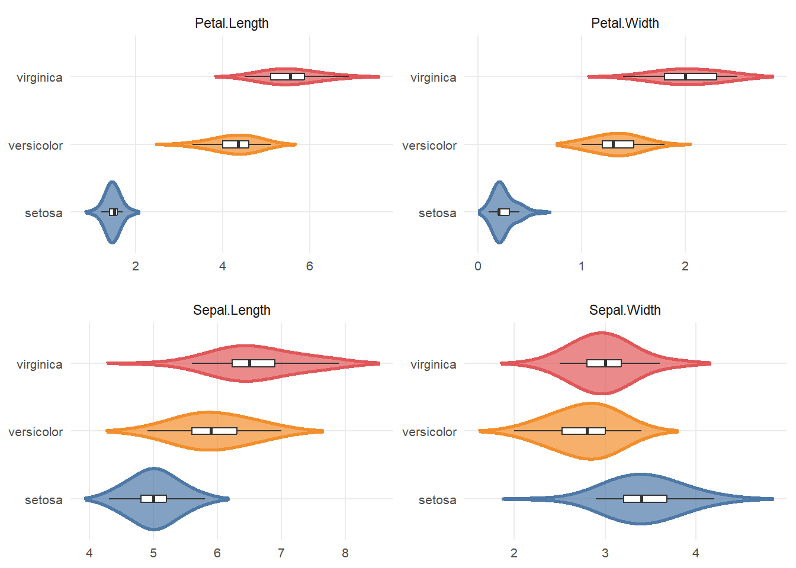

- [`plotMissing()`](#plotmissing)

  [(examples)](https://francisco.quarto.pub/explore-missing-values/)

  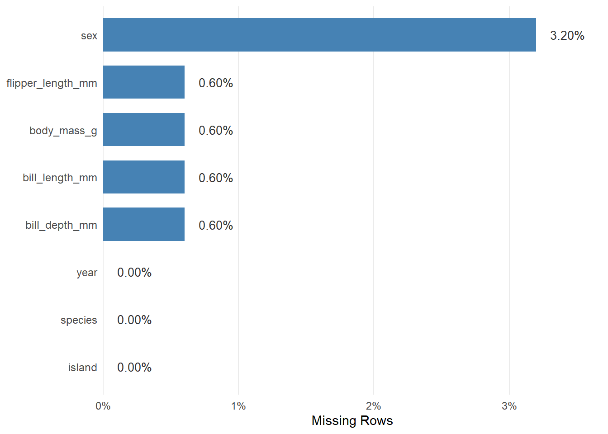

- [`plotCorrelate()`](#plotcorrelate)

  [(examples)](https://francisco.quarto.pub/explore-correlations-with-bar-charts/)

  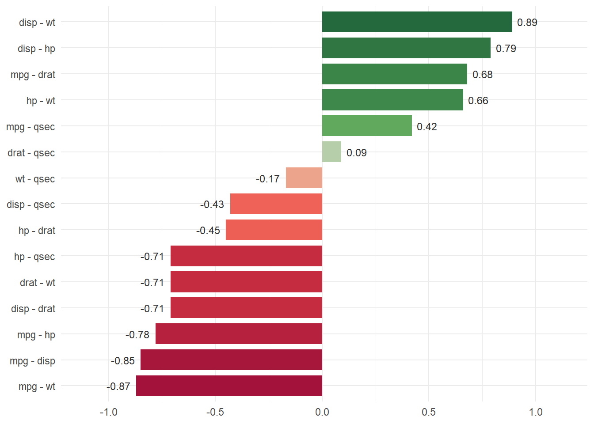

- [`exploreData()`](#exploredata)

```r
mtcars <- mtcars %>% mutate(across(c(am, carb, cyl, gear, vs), as.factor))
```
```r
exploreData(mtcars)
```
```
# A tibble: 11 × 7
   variable type        n   NAs NAsPct unique uniquePct
   <chr>    <chr>   <int> <int>  <dbl>  <int>     <dbl>
 1 am       numeric    32     0      0      2     0.062
 2 carb     numeric    32     0      0      6     0.188
 3 cyl      numeric    32     0      0      3     0.094
 4 disp     numeric    32     0      0     27     0.844
 5 drat     numeric    32     0      0     22     0.688
 6 gear     numeric    32     0      0      3     0.094
 7 hp       numeric    32     0      0     22     0.688
 8 mpg      numeric    32     0      0     25     0.781
 9 qsec     numeric    32     0      0     30     0.938
10 vs       numeric    32     0      0      2     0.062
11 wt       numeric    32     0      0     29     0.90
```

- [`exploreNumeric()`](#explorenumeric)

```r
exploreNumeric(mtcars)
```
```
# A tibble: 11 × 14
   variable     n    na naPct   min    max     Q1   mean median     Q3     sd zeros negatives outliers
   <chr>    <int> <int> <dbl> <dbl>  <dbl>  <dbl>  <dbl>  <dbl>  <dbl>  <dbl> <int>     <int>    <int>
 1 am          32     0     0  0      1      0      0.41   0      1      0.5     19         0        0
 2 carb        32     0     0  1      8      2      2.81   2      4      1.62     0         0        1
 3 cyl         32     0     0  4      8      4      6.19   6      8      1.79     0         0        0
 4 disp        32     0     0 71.1  472    121.   231.   196.   326    124.       0         0        0
 5 drat        32     0     0  2.76   4.93   3.08   3.6    3.7    3.92   0.53     0         0        0
 6 gear        32     0     0  3      5      3      3.69   4      4      0.74     0         0        0
 7 hp          32     0     0 52    335     96.5  147.   123    180     68.6      0         0        1
 8 mpg         32     0     0 10.4   33.9   15.4   20.1   19.2   22.8    6.03     0         0        0
 9 qsec        32     0     0 14.5   22.9   16.9   17.8   17.7   18.9    1.79     0         0        1
10 vs          32     0     0  0      1      0      0.44   0      1      0.5     18         0        0
11 wt          32     0     0  1.51   5.42   2.58   3.22   3.33   3.61   0.98     0         0        2
```

- [`exploreCategory()`](#explorecategory)

```r
exploreCategory(mtcars)
```
```
# A tibble: 16 × 6
   variable levels  freq     N ratio  rank
   <chr>    <chr>  <int> <int> <dbl> <int>
 1 am       0         19    32 0.594     1
 2 am       1         13    32 0.406     2
 3 carb     2         10    32 0.312     1
 4 carb     4         10    32 0.312     1
 5 carb     1          7    32 0.219     3
 6 carb     3          3    32 0.094     4
 7 carb     6          1    32 0.031     5
 8 carb     8          1    32 0.031     5
 9 cyl      8         14    32 0.438     1
10 cyl      4         11    32 0.344     2
11 cyl      6          7    32 0.219     3
12 gear     3         15    32 0.469     1
13 gear     4         12    32 0.375     2
14 gear     5          5    32 0.156     3
15 vs       0         18    32 0.562     1
16 vs       1         14    32 0.438     2
```

- [`descriptiveStats()`](#descriptivestats)

```r
descriptiveStats(mtcars)
```
```
# A tibble: 6 × 18
  variable     n    na   mean median     sd     se skewness kurtosis   min    max    IQR     Q1     Q3   p10    p25    p50    p75
  <chr>    <int> <int>  <dbl>  <dbl>  <dbl>  <dbl>    <dbl>    <dbl> <dbl>  <dbl>  <dbl>  <dbl>  <dbl> <dbl>  <dbl>  <dbl>  <dbl>
1 disp        32     0 231.   196.   124.   21.9      0.400     1.91 71.1  472    205.   121.   326    80.6  121.   196.   326   
2 drat        32     0   3.6    3.7    0.53  0.095    0.279     2.44  2.76   4.93   0.84   3.08   3.92  3.01   3.08   3.70   3.92
3 hp          32     0 147.   123     68.6  12.1      0.761     3.05 52    335     83.5   96.5  180    66     96.5  123    180   
4 mpg         32     0  20.1   19.2    6.03  1.06     0.640     2.80 10.4   33.9    7.38  15.4   22.8  14.3   15.4   19.2   22.8 
5 qsec        32     0  17.8   17.7    1.79  0.316    0.387     3.55 14.5   22.9    2.01  16.9   18.9  15.5   16.9   17.7   18.9 
6 wt          32     0   3.22   3.33   0.98  0.173    0.444     3.17  1.51   5.42   1.03   2.58   3.61  1.96   2.58   3.32   3.61
```

- [`correlate()`](#correlate)

```r
correlate(mtcars)
```
```
# A tibble: 15 × 4
   var1  var2  variables      cor
   <chr> <chr> <fct>        <dbl>
 1 disp  wt    disp - wt    0.888
 2 disp  hp    disp - hp    0.791
 3 mpg   drat  mpg - drat   0.681
 4 hp    wt    hp - wt      0.659
 5 mpg   qsec  mpg - qsec   0.419
 6 drat  qsec  drat - qsec  0.091
 7 wt    qsec  wt - qsec   -0.175
 8 disp  qsec  disp - qsec -0.434
 9 hp    drat  hp - drat   -0.449
10 hp    qsec  hp - qsec   -0.708
11 disp  drat  disp - drat -0.71 
12 drat  wt    drat - wt   -0.712
13 mpg   hp    mpg - hp    -0.776
14 mpg   disp  mpg - disp  -0.848
15 mpg   wt    mpg - wt    -0.868
```

**Charts**

- [`line_chart()`](#linechart)

  [(examples)](https://francisco.quarto.pub/line-chart/)

  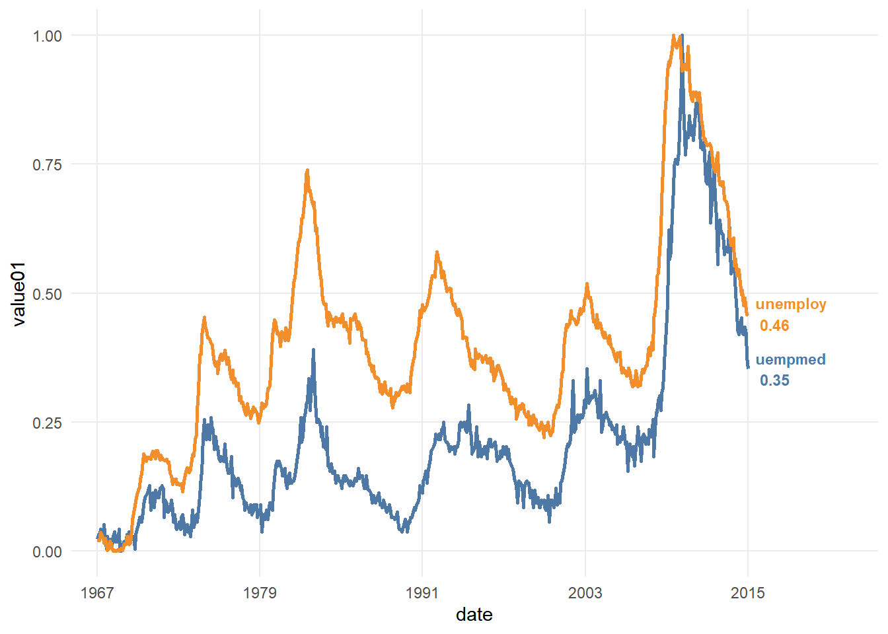

- [`bubble_chart()`](#bubblechart)

  [(examples)](https://francisco.quarto.pub/bubble-chart/)

  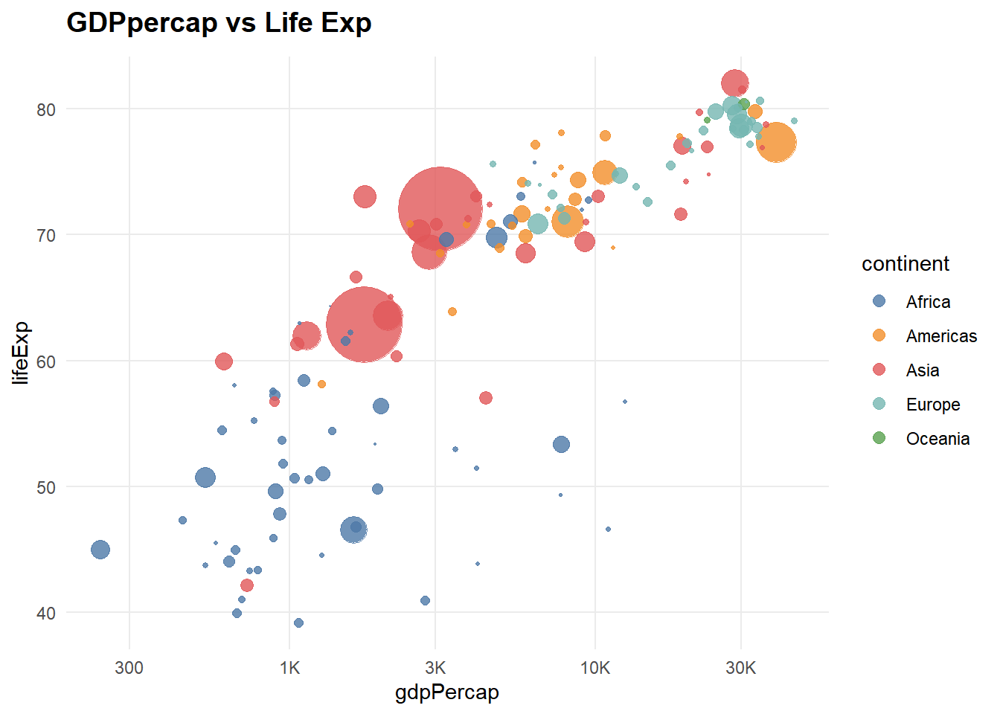

- [`scatter_chart()`](#scatterchart)

  [(examples)](https://francisco.quarto.pub/scatter-chart/)

  

- [`bar_chart()`](#barchart)

  [(examples)](https://francisco.quarto.pub/bar-chart/)

  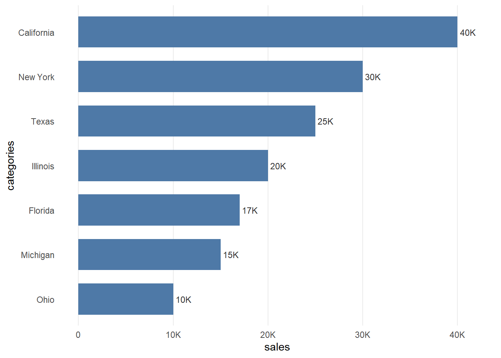

- [`yoy_chart()`](#yoychart)

  [(examples)](https://francisco.quarto.pub/yoy-chart/)

  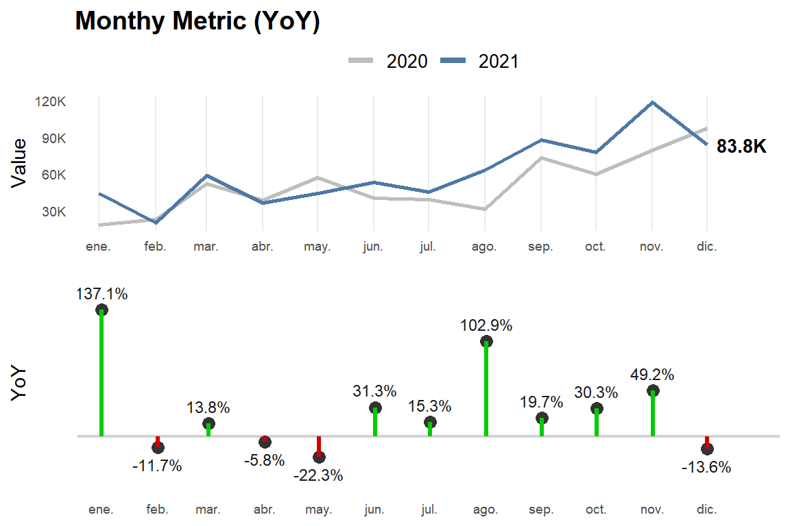

- [`yoy_barchart()`](#yoybarchart)

  [(examples)](https://francisco.quarto.pub/yoy-chart-by-category/)

  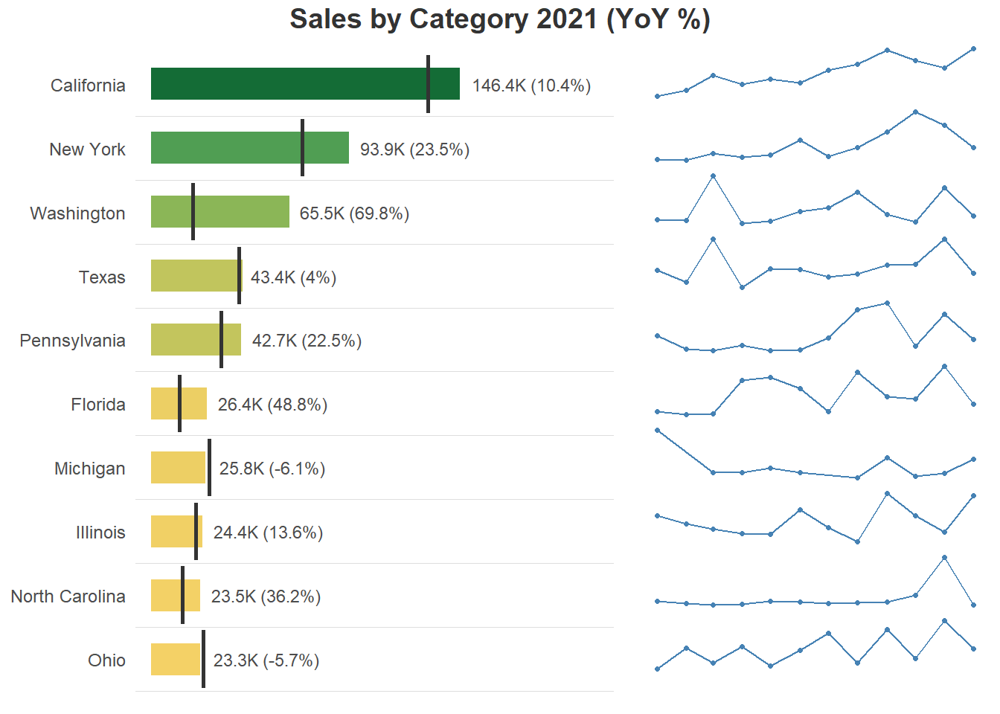

- [`yoy_barchart0()`](#yoycategorychart2)

  [(examples)](https://francisco.quarto.pub/yoy-chart-by-category/#stat-identity)

  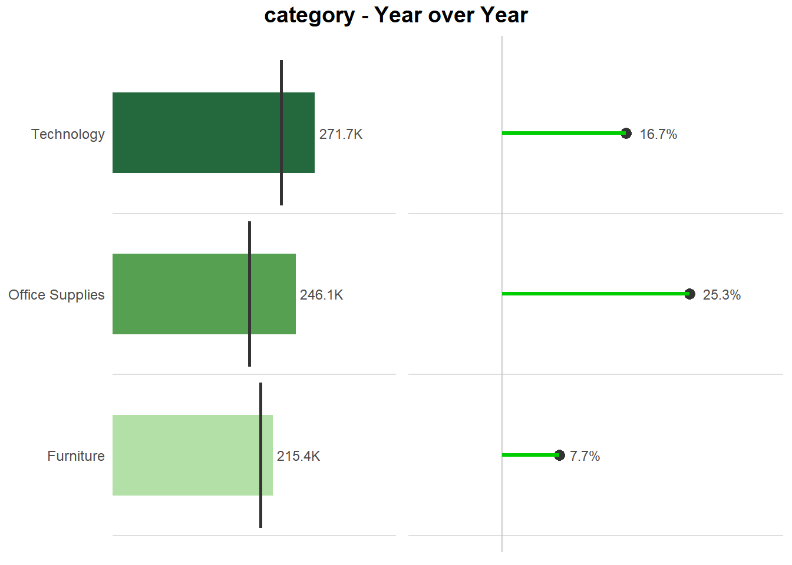

- [`card_kpi_line()`](#cardkpiline)

  [(examples)](https://francisco.quarto.pub/kpi-card-with-line-chart/)

  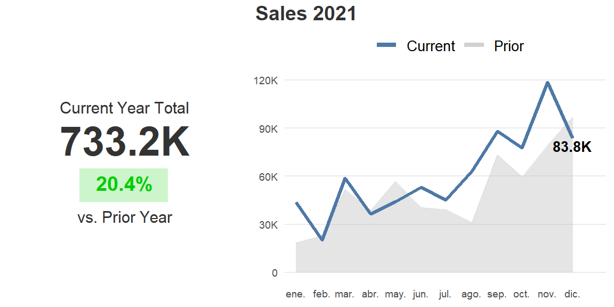


